Differential Expression Analysis for RNA-seq data in MW2 and LacFitz
================
Patricia Tran
2025-03-18

# Load packages:

``` r
library(tidyverse)
```

    ## Warning: package 'purrr' was built under R version 4.4.1

    ## Warning: package 'lubridate' was built under R version 4.4.1

    ## ── Attaching core tidyverse packages ──────────────────────── tidyverse 2.0.0 ──
    ## ✔ dplyr     1.1.4     ✔ readr     2.1.5
    ## ✔ forcats   1.0.0     ✔ stringr   1.5.1
    ## ✔ ggplot2   3.5.1     ✔ tibble    3.2.1
    ## ✔ lubridate 1.9.4     ✔ tidyr     1.3.1
    ## ✔ purrr     1.0.4     
    ## ── Conflicts ────────────────────────────────────────── tidyverse_conflicts() ──
    ## ✖ dplyr::filter() masks stats::filter()
    ## ✖ dplyr::lag()    masks stats::lag()
    ## ℹ Use the conflicted package (<http://conflicted.r-lib.org/>) to force all conflicts to become errors

``` r
library(DESeq2)
```

    ## Loading required package: S4Vectors

    ## Warning: package 'S4Vectors' was built under R version 4.4.1

    ## Loading required package: stats4
    ## Loading required package: BiocGenerics
    ## 
    ## Attaching package: 'BiocGenerics'
    ## 
    ## The following objects are masked from 'package:lubridate':
    ## 
    ##     intersect, setdiff, union
    ## 
    ## The following objects are masked from 'package:dplyr':
    ## 
    ##     combine, intersect, setdiff, union
    ## 
    ## The following objects are masked from 'package:stats':
    ## 
    ##     IQR, mad, sd, var, xtabs
    ## 
    ## The following objects are masked from 'package:base':
    ## 
    ##     anyDuplicated, aperm, append, as.data.frame, basename, cbind,
    ##     colnames, dirname, do.call, duplicated, eval, evalq, Filter, Find,
    ##     get, grep, grepl, intersect, is.unsorted, lapply, Map, mapply,
    ##     match, mget, order, paste, pmax, pmax.int, pmin, pmin.int,
    ##     Position, rank, rbind, Reduce, rownames, sapply, setdiff, table,
    ##     tapply, union, unique, unsplit, which.max, which.min
    ## 
    ## 
    ## Attaching package: 'S4Vectors'
    ## 
    ## The following objects are masked from 'package:lubridate':
    ## 
    ##     second, second<-
    ## 
    ## The following objects are masked from 'package:dplyr':
    ## 
    ##     first, rename
    ## 
    ## The following object is masked from 'package:tidyr':
    ## 
    ##     expand
    ## 
    ## The following object is masked from 'package:utils':
    ## 
    ##     findMatches
    ## 
    ## The following objects are masked from 'package:base':
    ## 
    ##     expand.grid, I, unname
    ## 
    ## Loading required package: IRanges

    ## Warning: package 'IRanges' was built under R version 4.4.1

    ## 
    ## Attaching package: 'IRanges'
    ## 
    ## The following object is masked from 'package:lubridate':
    ## 
    ##     %within%
    ## 
    ## The following objects are masked from 'package:dplyr':
    ## 
    ##     collapse, desc, slice
    ## 
    ## The following object is masked from 'package:purrr':
    ## 
    ##     reduce
    ## 
    ## Loading required package: GenomicRanges

    ## Warning: package 'GenomicRanges' was built under R version 4.4.1

    ## Loading required package: GenomeInfoDb
    ## Loading required package: SummarizedExperiment
    ## Loading required package: MatrixGenerics
    ## Loading required package: matrixStats

    ## Warning: package 'matrixStats' was built under R version 4.4.1

    ## 
    ## Attaching package: 'matrixStats'
    ## 
    ## The following object is masked from 'package:dplyr':
    ## 
    ##     count
    ## 
    ## 
    ## Attaching package: 'MatrixGenerics'
    ## 
    ## The following objects are masked from 'package:matrixStats':
    ## 
    ##     colAlls, colAnyNAs, colAnys, colAvgsPerRowSet, colCollapse,
    ##     colCounts, colCummaxs, colCummins, colCumprods, colCumsums,
    ##     colDiffs, colIQRDiffs, colIQRs, colLogSumExps, colMadDiffs,
    ##     colMads, colMaxs, colMeans2, colMedians, colMins, colOrderStats,
    ##     colProds, colQuantiles, colRanges, colRanks, colSdDiffs, colSds,
    ##     colSums2, colTabulates, colVarDiffs, colVars, colWeightedMads,
    ##     colWeightedMeans, colWeightedMedians, colWeightedSds,
    ##     colWeightedVars, rowAlls, rowAnyNAs, rowAnys, rowAvgsPerColSet,
    ##     rowCollapse, rowCounts, rowCummaxs, rowCummins, rowCumprods,
    ##     rowCumsums, rowDiffs, rowIQRDiffs, rowIQRs, rowLogSumExps,
    ##     rowMadDiffs, rowMads, rowMaxs, rowMeans2, rowMedians, rowMins,
    ##     rowOrderStats, rowProds, rowQuantiles, rowRanges, rowRanks,
    ##     rowSdDiffs, rowSds, rowSums2, rowTabulates, rowVarDiffs, rowVars,
    ##     rowWeightedMads, rowWeightedMeans, rowWeightedMedians,
    ##     rowWeightedSds, rowWeightedVars
    ## 
    ## Loading required package: Biobase
    ## Welcome to Bioconductor
    ## 
    ##     Vignettes contain introductory material; view with
    ##     'browseVignettes()'. To cite Bioconductor, see
    ##     'citation("Biobase")', and for packages 'citation("pkgname")'.
    ## 
    ## 
    ## Attaching package: 'Biobase'
    ## 
    ## The following object is masked from 'package:MatrixGenerics':
    ## 
    ##     rowMedians
    ## 
    ## The following objects are masked from 'package:matrixStats':
    ## 
    ##     anyMissing, rowMedians

``` r
library(EnhancedVolcano)
```

    ## Loading required package: ggrepel

    ## Warning: package 'ggrepel' was built under R version 4.4.1

``` r
library(plotly)
```

    ## 
    ## Attaching package: 'plotly'
    ## 
    ## The following object is masked from 'package:IRanges':
    ## 
    ##     slice
    ## 
    ## The following object is masked from 'package:S4Vectors':
    ## 
    ##     rename
    ## 
    ## The following object is masked from 'package:ggplot2':
    ## 
    ##     last_plot
    ## 
    ## The following object is masked from 'package:stats':
    ## 
    ##     filter
    ## 
    ## The following object is masked from 'package:graphics':
    ## 
    ##     layout

# MW2 (Control vs Treated)

## Make it into a matrix format:

``` r
genes <- c("ebh",
"ureA",
"ureB",
"ureC",
"ureD",
"ureE",
"ureF",
"ureG",
"lytN",
"fmhC",
"essA",
"essB",
"essB",
"crtM",
"crtN",
"crtP",
"agrA",
"tarM",
"lukD",
"lukE")

setwd("~/OneDrive - UW-Madison/BioinformaticsJob/WorkProjects/Dept-of-Bacteriology/Mo_Lab/Mo_comparison_MRSA/3March2025_RNAseq/")

mw2 <- read.table("MW2_transcripts.txt", header=TRUE)
mw2 <- mw2 %>% mutate(Geneid_start_end = paste0(Geneid," (",Start,"-",End,")"))


genes_mw2 <- mw2 %>% filter(Geneid %in% genes) %>% pull(Geneid_start_end)
# Note: because we count the reads per gene, you will notice that when a gene is present more than once, there will be multiple start and end positions listed.

colnames(mw2)
```

    ##  [1] "Geneid"                                    
    ##  [2] "Chr"                                       
    ##  [3] "Start"                                     
    ##  [4] "End"                                       
    ##  [5] "Strand"                                    
    ##  [6] "Length"                                    
    ##  [7] "mapping.M.A_S488_L006_vs_MW2.sorted.bam"   
    ##  [8] "mapping.M.B_S489_L006_vs_MW2.sorted.bam"   
    ##  [9] "mapping.M.C_S490_L006_vs_MW2.sorted.bam"   
    ## [10] "mapping.MplusA_S494_L006_vs_MW2.sorted.bam"
    ## [11] "mapping.MplusB_S495_L006_vs_MW2.sorted.bam"
    ## [12] "mapping.MplusC_S496_L006_vs_MW2.sorted.bam"
    ## [13] "Geneid_start_end"

``` r
mw2.matrix <- mw2[,c(13,7:12)]
#mw2.matrix <- column_to_rownames(mw2.matrix, "Geneid_start_end")

length(rownames(mw2.matrix))
```

    ## [1] 2248

``` r
length(unique(rownames(mw2.matrix)))
```

    ## [1] 2248

``` r
# Load metadata
metaData <- read.table("samples.txt", sep=",", header=FALSE)
colnames(metaData) <- c("Sample","ref","Treatment","Replicate")

# Clean up column names so that they match the sample names in metaData
colnames(mw2.matrix)
```

    ## [1] "Geneid_start_end"                          
    ## [2] "mapping.M.A_S488_L006_vs_MW2.sorted.bam"   
    ## [3] "mapping.M.B_S489_L006_vs_MW2.sorted.bam"   
    ## [4] "mapping.M.C_S490_L006_vs_MW2.sorted.bam"   
    ## [5] "mapping.MplusA_S494_L006_vs_MW2.sorted.bam"
    ## [6] "mapping.MplusB_S495_L006_vs_MW2.sorted.bam"
    ## [7] "mapping.MplusC_S496_L006_vs_MW2.sorted.bam"

``` r
colnames(mw2.matrix) <- str_replace(colnames(mw2.matrix),"mapping.M\\.","M\\-")
colnames(mw2.matrix) <- str_replace(colnames(mw2.matrix),"mapping\\.","\\")
colnames(mw2.matrix) <- str_replace(colnames(mw2.matrix),"_vs_MW2.sorted.bam","")
```

## Run DESeq2 analysis:

``` r
metaData_mw2 <- metaData %>% filter(ref == "MW2")

dds <- DESeqDataSetFromMatrix(countData=mw2.matrix, 
                              colData=metaData_mw2,
                              design=~Treatment, 
                              tidy = TRUE)
```

    ## Warning in DESeqDataSet(se, design = design, ignoreRank): some variables in
    ## design formula are characters, converting to factors

``` r
dds <- DESeq(dds)
```

    ## estimating size factors

    ## estimating dispersions

    ## gene-wise dispersion estimates

    ## mean-dispersion relationship

    ## final dispersion estimates

    ## fitting model and testing

``` r
dds
```

    ## class: DESeqDataSet 
    ## dim: 2248 6 
    ## metadata(1): version
    ## assays(4): counts mu H cooks
    ## rownames(2248): aRO8 (11013-12395) pdxS (12499-13386) ... folK
    ##   (2816533-2817009) lysS (2817548-2819035)
    ## rowData names(22): baseMean baseVar ... deviance maxCooks
    ## colnames(6): M-A_S488_L006 M-B_S489_L006 ... MplusB_S495_L006
    ##   MplusC_S496_L006
    ## colData names(5): Sample ref Treatment Replicate sizeFactor

``` r
# take a look at the results:

res <- results(dds)
head(results(dds, tidy=TRUE)) 
```

    ##                                                row  baseMean log2FoldChange
    ## 1                               aRO8 (11013-12395)  1342.727      0.6839222
    ## 2                               pdxS (12499-13386) 31220.386     -0.9700896
    ## 3                               pdxT (13390-13950) 23497.517     -1.0228988
    ## 4 nupC (14156;154177;2621655-15370;155406;2622875) 77213.941      0.1265169
    ## 5                               ctsR (15519-15989)  3897.223      0.6905320
    ## 6                               mcsA (16008-16574)  3163.217      0.5628524
    ##       lfcSE       stat       pvalue         padj
    ## 1 0.1327239  5.1529697 2.563935e-07 1.330041e-06
    ## 2 0.2012020 -4.8214715 1.425031e-06 6.723145e-06
    ## 3 0.1743818 -5.8658568 4.468192e-09 2.820864e-08
    ## 4 0.1552961  0.8146818 4.152545e-01 5.246389e-01
    ## 5 0.2255716  3.0612541 2.204119e-03 5.817941e-03
    ## 6 0.2446941  2.3002283 2.143529e-02 4.370926e-02

``` r
# Summarize results:
summary(res)
```

    ## 
    ## out of 2246 with nonzero total read count
    ## adjusted p-value < 0.1
    ## LFC > 0 (up)       : 635, 28%
    ## LFC < 0 (down)     : 635, 28%
    ## outliers [1]       : 5, 0.22%
    ## low counts [2]     : 0, 0%
    ## (mean count < 1)
    ## [1] see 'cooksCutoff' argument of ?results
    ## [2] see 'independentFiltering' argument of ?results

``` r
# Sort by p-value:
res <- res[order(res$padj),]
head(res)
```

    ## log2 fold change (MLE): Treatment Treated vs Control 
    ## Wald test p-value: Treatment Treated vs Control 
    ## DataFrame with 6 rows and 6 columns
    ##                                 baseMean log2FoldChange     lfcSE      stat
    ##                                <numeric>      <numeric> <numeric> <numeric>
    ## ebh (905874-935588)             415978.7        7.12649  0.127438   55.9212
    ## sarU (2039476-2040219)           47707.3        9.72757  0.234549   41.4734
    ## lytN (698053-699171)             20290.8        7.47441  0.202669   36.8800
    ## tarM (475515-476996)             14056.5        6.63019  0.181541   36.5218
    ## DBIAII_02021 (2034376-2038491)  339542.7        9.45076  0.275812   34.2652
    ## fmhC (699199-700443)             15498.4        5.61582  0.176119   31.8865
    ##                                      pvalue         padj
    ##                                   <numeric>    <numeric>
    ## ebh (905874-935588)             0.00000e+00  0.00000e+00
    ## sarU (2039476-2040219)          0.00000e+00  0.00000e+00
    ## lytN (698053-699171)           9.68148e-298 7.23207e-295
    ## tarM (475515-476996)           5.00643e-292 2.80485e-289
    ## DBIAII_02021 (2034376-2038491) 2.58828e-257 1.16007e-254
    ## fmhC (699199-700443)           4.10746e-223 1.53414e-220

``` r
# Save table of results
write.table(as.data.frame(res) %>% rownames_to_column("gene_start_end_direction"), "output/MW2_rnaseq.results.tsv", sep="\t", row.names = FALSE)

res_table_MW2 <- as.data.frame(res) %>% rownames_to_column("gene_start_end_direction") %>%
  filter(gene_start_end_direction %in% genes_mw2)

min(res_table_MW2$padj)
```

    ## [1] 0

``` r
# The maximum pavalu is 0.001 so if we choose 0.002 that should emcompass it.
max(res_table_MW2$padj)
```

    ## [1] 0.001433648

## Plotting:

``` r
# Plot counts:
par(mfrow=c(2,3))
# The genes are the top sorted gene by p-value
plotCounts(dds, gene="ebh (905874-935588)", intgroup="Treatment")
plotCounts(dds, gene="sarU (2039476-2040219)", intgroup="Treatment")
plotCounts(dds, gene="lytN (698053-699171)", intgroup="Treatment")
plotCounts(dds, gene="tarM (475515-476996)", intgroup="Treatment")
plotCounts(dds, gene="DBIAII_02021 (2034376-2038491)", intgroup="Treatment")
plotCounts(dds, gene="fmhC (699199-700443)", intgroup="Treatment")
```

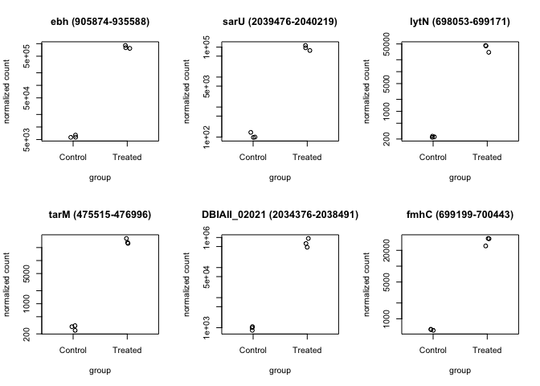<!-- -->

``` r
# PCA plot:
vsdata <- vst(dds, blind=FALSE)
plotPCA(vsdata, intgroup="Treatment") + theme_bw() + 
  theme(panel.grid = element_blank()) 
```

    ## using ntop=500 top features by variance

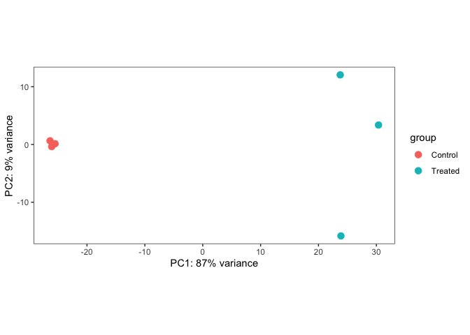<!-- -->

``` r
EnhancedVolcano(res,
                lab = str_replace(rownames(res),"\\(.*",""),
                subtitle = "(control vs treated)",
                x = 'log2FoldChange',
                y = 'padj',
                col=c("grey30", "lightblue3", "green", "red2"),
                labSize = 3,
                pCutoff = 10e-32,
                title = 'MW2 RNA-seq data',
                drawConnectors = TRUE,
                widthConnectors = 0.40)
```

    ## Warning: One or more p-values is 0. Converting to 10^-1 * current lowest
    ## non-zero p-value...

    ## Warning: ggrepel: 52 unlabeled data points (too many overlaps). Consider
    ## increasing max.overlaps

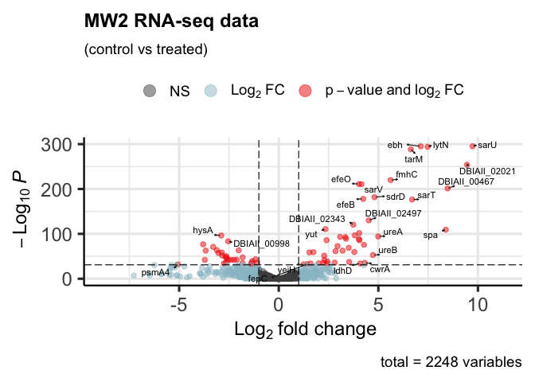<!-- -->

``` r
ggsave("figures/volcanoplot_rnaseq_MW2.pdf", width = 8, height = 8)
```

    ## Warning: ggrepel: 23 unlabeled data points (too many overlaps). Consider
    ## increasing max.overlaps

``` r
EnhancedVolcano(res,
                lab = str_replace(rownames(res),"\\(.*",""),
                subtitle = "(control vs treated)",
                x = 'log2FoldChange',
                y = 'padj',
                col=c("grey30", "lightblue3", "green", "red2"),
                labSize = 3,
                pCutoff = 0.002,
                title = 'MW2 RNA-seq data',
                drawConnectors = TRUE,
                widthConnectors = 0.40)
```

    ## Warning: One or more p-values is 0. Converting to 10^-1 * current lowest
    ## non-zero p-value...

    ## Warning: ggrepel: 396 unlabeled data points (too many overlaps). Consider
    ## increasing max.overlaps

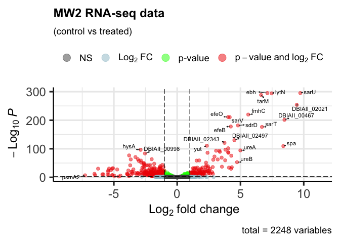<!-- -->

``` r
ggsave("figures/volcanoplot_rnaseq_MW2_pajd_value=0.002.pdf", width = 8, height = 8)
```

    ## Warning: ggrepel: 366 unlabeled data points (too many overlaps). Consider
    ## increasing max.overlaps

``` r
# Label only the ones from the paper:
EnhancedVolcano(res,
                lab = str_replace(rownames(res),"\\(.*",""),
                selectLab = str_replace(genes_mw2,"\\(.*",""),
                subtitle = "(control vs treated)",
                x = 'log2FoldChange',
                y = 'padj',
                col=c("grey30", "lightblue3", "green", "red2"),
                labSize = 3,
                pCutoff = 0.002,
                title = 'MW2 RNA-seq data',
                drawConnectors = TRUE,
                widthConnectors = 0.40)
```

    ## Warning: One or more p-values is 0. Converting to 10^-1 * current lowest
    ## non-zero p-value...

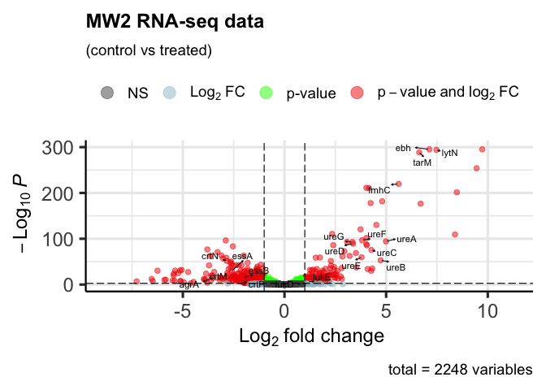<!-- -->

``` r
ggsave("figures/volcanoplot_rnaseq_MW2_pajd_value=0.002_selectLabelsOnly.pdf", width = 8, height = 8)
```

# LacFitz (Control vs Treated)

## Make it into a matrix format:

``` r
lf <- read.table("LacFitz_transcripts.txt", header=TRUE)
lf <- lf %>% mutate(Geneid_start_end = paste0(Geneid," (",Start,"-",End,")"))

genes_lf <- lf %>% filter(Geneid %in% genes) %>% pull(Geneid_start_end)
genes_lf
```

    ##  [1] "tarM (484942-486423)"   "lytN (706755-707873)"   "fmhC (707901-709145)"  
    ##  [4] "ebh (914411-945676)"    "lukD (1399720-1400703)" "lukE (1400705-1401640)"
    ##  [7] "agrA (1593273-1593989)" "ureA (1849265-1849567)" "ureB (1849581-1849991)"
    ## [10] "ureC (1849988-1851703)" "ureE (1851716-1852168)" "ureF (1852161-1852850)"
    ## [13] "ureG (1852863-1853477)" "ureD (1853477-1854313)" "crtN (2145939-2147447)"
    ## [16] "crtM (2147459-2148322)" "crtP (2149492-2150985)" "essA (2651263-2651721)"
    ## [19] "essB (2651948-2653282)"

``` r
# Note: because we count the reads per gene, you will notice that when a gene is present more than once, there will be multiple start and end positions listed.

colnames(lf)
```

    ##  [1] "Geneid"                                        
    ##  [2] "Chr"                                           
    ##  [3] "Start"                                         
    ##  [4] "End"                                           
    ##  [5] "Strand"                                        
    ##  [6] "Length"                                        
    ##  [7] "mapping.L.A_S491_L006_vs_LacFitz.sorted.bam"   
    ##  [8] "mapping.L.B_S492_L006_vs_LacFitz.sorted.bam"   
    ##  [9] "mapping.L.C_S493_L006_vs_LacFitz.sorted.bam"   
    ## [10] "mapping.LplusA_S498_L006_vs_LacFitz.sorted.bam"
    ## [11] "mapping.LplusB_S499_L006_vs_LacFitz.sorted.bam"
    ## [12] "mapping.LplusC_S500_L006_vs_LacFitz.sorted.bam"
    ## [13] "Geneid_start_end"

``` r
lf.matrix <- lf[,c(13,7:12)]
#lf.matrix <- column_to_rownames(lf.matrix, "Geneid_start_end")

length(rownames(lf.matrix))
```

    ## [1] 2341

``` r
length(unique(rownames(lf.matrix)))
```

    ## [1] 2341

``` r
# Load metadata
metaData <- read.table("samples.txt", sep=",", header=FALSE)
colnames(metaData) <- c("Sample","ref","Treatment","Replicate")

# Clean up column names so that they match the sample names in metaData
colnames(lf.matrix)
```

    ## [1] "Geneid_start_end"                              
    ## [2] "mapping.L.A_S491_L006_vs_LacFitz.sorted.bam"   
    ## [3] "mapping.L.B_S492_L006_vs_LacFitz.sorted.bam"   
    ## [4] "mapping.L.C_S493_L006_vs_LacFitz.sorted.bam"   
    ## [5] "mapping.LplusA_S498_L006_vs_LacFitz.sorted.bam"
    ## [6] "mapping.LplusB_S499_L006_vs_LacFitz.sorted.bam"
    ## [7] "mapping.LplusC_S500_L006_vs_LacFitz.sorted.bam"

``` r
colnames(lf.matrix) <- str_replace(colnames(lf.matrix),"mapping.L\\.","L\\-")
colnames(lf.matrix)
```

    ## [1] "Geneid_start_end"                              
    ## [2] "L-A_S491_L006_vs_LacFitz.sorted.bam"           
    ## [3] "L-B_S492_L006_vs_LacFitz.sorted.bam"           
    ## [4] "L-C_S493_L006_vs_LacFitz.sorted.bam"           
    ## [5] "mapping.LplusA_S498_L006_vs_LacFitz.sorted.bam"
    ## [6] "mapping.LplusB_S499_L006_vs_LacFitz.sorted.bam"
    ## [7] "mapping.LplusC_S500_L006_vs_LacFitz.sorted.bam"

``` r
colnames(lf.matrix) <- str_replace(colnames(lf.matrix),"mapping\\.","\\")
colnames(lf.matrix)
```

    ## [1] "Geneid_start_end"                      
    ## [2] "L-A_S491_L006_vs_LacFitz.sorted.bam"   
    ## [3] "L-B_S492_L006_vs_LacFitz.sorted.bam"   
    ## [4] "L-C_S493_L006_vs_LacFitz.sorted.bam"   
    ## [5] "LplusA_S498_L006_vs_LacFitz.sorted.bam"
    ## [6] "LplusB_S499_L006_vs_LacFitz.sorted.bam"
    ## [7] "LplusC_S500_L006_vs_LacFitz.sorted.bam"

``` r
colnames(lf.matrix) <- str_replace(colnames(lf.matrix),"_vs_LacFitz.sorted.bam","")

colnames(lf.matrix)
```

    ## [1] "Geneid_start_end" "L-A_S491_L006"    "L-B_S492_L006"    "L-C_S493_L006"   
    ## [5] "LplusA_S498_L006" "LplusB_S499_L006" "LplusC_S500_L006"

## Run DESeq2 analysis:

``` r
metaData_lf <- metaData %>% filter(ref == "LacFitz")

dds <- DESeqDataSetFromMatrix(countData=lf.matrix, 
                              colData=metaData_lf,
                              design=~Treatment, 
                              tidy = TRUE)
```

    ## Warning in DESeqDataSet(se, design = design, ignoreRank): some variables in
    ## design formula are characters, converting to factors

``` r
dds <- DESeq(dds)
```

    ## estimating size factors

    ## estimating dispersions

    ## gene-wise dispersion estimates

    ## mean-dispersion relationship

    ## final dispersion estimates

    ## fitting model and testing

``` r
dds
```

    ## class: DESeqDataSet 
    ## dim: 2341 6 
    ## metadata(1): version
    ## assays(4): counts mu H cooks
    ## rownames(2341): aRO8 (10809-12191) pdxS (12295-13182) ... PBCCJM_02871
    ##   (4534-5115) PBCCJM_02872 (5190-5363)
    ## rowData names(22): baseMean baseVar ... deviance maxCooks
    ## colnames(6): L-A_S491_L006 L-B_S492_L006 ... LplusB_S499_L006
    ##   LplusC_S500_L006
    ## colData names(5): Sample ref Treatment Replicate sizeFactor

``` r
# take a look at the results:

res <- results(dds)
head(results(dds, tidy=TRUE)) 
```

    ##                                                row  baseMean log2FoldChange
    ## 1                               aRO8 (10809-12191)  1218.926     0.38281663
    ## 2                               pdxS (12295-13182) 32559.081     0.16701435
    ## 3                               pdxT (13186-13746) 30002.423    -0.05643259
    ## 4 nupC (13954;162864;2681211-15168;164093;2682431) 92784.308     0.46976531
    ## 5                               ctsR (15317-15787)  3549.114     0.28420743
    ## 6                               mcsA (15806-16372)  3196.203     0.28712461
    ##       lfcSE       stat       pvalue        padj
    ## 1 0.1537372  2.4900714 0.0127717424 0.028076022
    ## 2 0.2793123  0.5979484 0.5498743346 0.643139239
    ## 3 0.2531810 -0.2228942 0.8236178291 0.871778214
    ## 4 0.1324257  3.5473877 0.0003890716 0.001216571
    ## 5 0.1370958  2.0730565 0.0381670227 0.073632799
    ## 6 0.1203613  2.3855223 0.0170548889 0.036286664

``` r
# Summarize results:
summary(res)
```

    ## 
    ## out of 2320 with nonzero total read count
    ## adjusted p-value < 0.1
    ## LFC > 0 (up)       : 641, 28%
    ## LFC < 0 (down)     : 631, 27%
    ## outliers [1]       : 3, 0.13%
    ## low counts [2]     : 0, 0%
    ## (mean count < 0)
    ## [1] see 'cooksCutoff' argument of ?results
    ## [2] see 'independentFiltering' argument of ?results

``` r
# Sort by p-value:
res <- res[order(res$padj),]
head(res)
```

    ## log2 fold change (MLE): Treatment Treated vs Control 
    ## Wald test p-value: Treatment Treated vs Control 
    ## DataFrame with 6 rows and 6 columns
    ##                                  baseMean log2FoldChange     lfcSE      stat
    ##                                 <numeric>      <numeric> <numeric> <numeric>
    ## PBCCJM_00477 (480024-480101)     40400.13        4.54247 0.0701105   64.7901
    ## ebh (914411-945676)            1343713.11        8.96697 0.1042907   85.9805
    ## sarV (1832019-1832369)           26350.41        6.03305 0.1267921   47.5822
    ## fmhA (1975906-1977156)            9235.99        4.09525 0.0977144   41.9104
    ## ywqE (2266704-2267471)           22015.27        7.61706 0.1406949   54.1389
    ## PBCCJM_02436 (2465629-2466600)   27074.50        8.47847 0.1558688   54.3949
    ##                                   pvalue      padj
    ##                                <numeric> <numeric>
    ## PBCCJM_00477 (480024-480101)           0         0
    ## ebh (914411-945676)                    0         0
    ## sarV (1832019-1832369)                 0         0
    ## fmhA (1975906-1977156)                 0         0
    ## ywqE (2266704-2267471)                 0         0
    ## PBCCJM_02436 (2465629-2466600)         0         0

``` r
# Save table of results
write.table(as.data.frame(res) %>% rownames_to_column("gene_start_end_direction"), "output/LacFitz_rnaseq.results.tsv", sep="\t", row.names = FALSE)

res_table_lf <- as.data.frame(res) %>% rownames_to_column("gene_start_end_direction") %>%
  filter(gene_start_end_direction %in% genes_lf)

min(res_table_lf$padj)
```

    ## [1] 0

``` r
# The maximum pavalue is 0.00003389677 so if we choose 0.002 that should emcompass it.
max(res_table_lf$padj)
```

    ## [1] 3.389677e-05

## Plotting:

``` r
# Plot counts:
par(mfrow=c(2,3))
# The genes are the top sorted gene by p-value
plotCounts(dds, gene="PBCCJM_00477 (480024-480101)", intgroup="Treatment")
plotCounts(dds, gene="ebh (914411-945676)", intgroup="Treatment")
plotCounts(dds, gene="sarV (1832019-1832369)", intgroup="Treatment")
plotCounts(dds, gene="fmhA (1975906-1977156)", intgroup="Treatment")
plotCounts(dds, gene="ywqE (2266704-2267471)", intgroup="Treatment")
plotCounts(dds, gene="PBCCJM_02436 (2465629-2466600)", intgroup="Treatment")
```

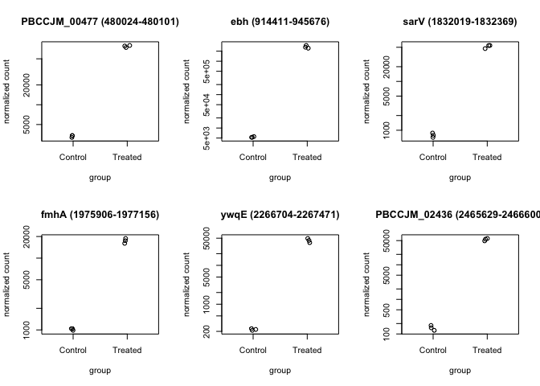<!-- -->

``` r
# PCA plot:
vsdata <- vst(dds, blind=FALSE)
plotPCA(vsdata, intgroup="Treatment") + 
  theme_bw() + 
  theme(panel.grid = element_blank()) 
```

    ## using ntop=500 top features by variance

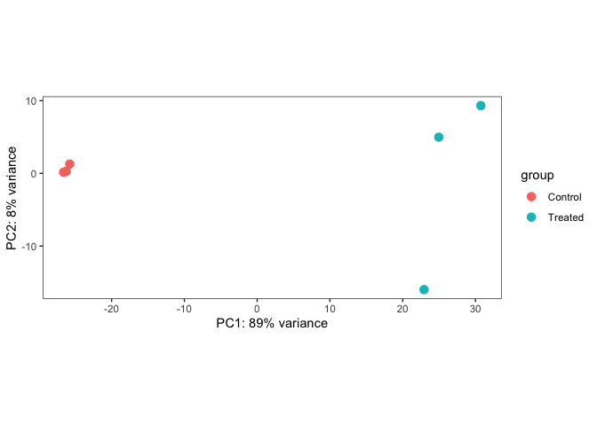<!-- -->

``` r
EnhancedVolcano(res,
                lab = str_replace(rownames(res),"\\(.*",""),
                subtitle = "(control vs treated)",
                x = 'log2FoldChange',
                y = 'padj',
                col=c("grey30", "lightblue3", "green", "red2"),
                labSize = 3,
                pCutoff = 10e-32,
                title = 'LacFitz RNA-seq data',
                drawConnectors = TRUE,
                widthConnectors = 0.40)
```

    ## Warning: One or more p-values is 0. Converting to 10^-1 * current lowest
    ## non-zero p-value...

    ## Warning: ggrepel: 60 unlabeled data points (too many overlaps). Consider
    ## increasing max.overlaps

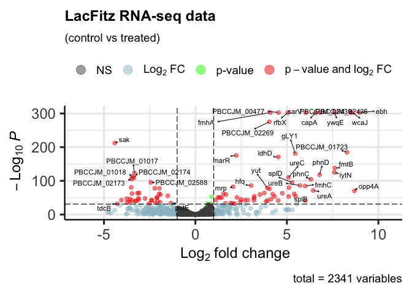<!-- -->

``` r
ggsave("figures/volcanoplot_rnaseq_LacFitz.pdf", width = 8, height = 8)
```

    ## Warning: ggrepel: 28 unlabeled data points (too many overlaps). Consider
    ## increasing max.overlaps

``` r
# Smaller p-value:
EnhancedVolcano(res,
                lab = str_replace(rownames(res),"\\(.*",""),
                subtitle = "(control vs treated)",
                x = 'log2FoldChange',
                y = 'padj',
                col=c("grey30", "lightblue3", "green", "red2"),
                labSize = 3,
                pCutoff = 0.002,
                title = 'LacFitz RNA-seq data',
                drawConnectors = TRUE,
                widthConnectors = 0.40)
```

    ## Warning: One or more p-values is 0. Converting to 10^-1 * current lowest
    ## non-zero p-value...

    ## Warning: ggrepel: 341 unlabeled data points (too many overlaps). Consider
    ## increasing max.overlaps

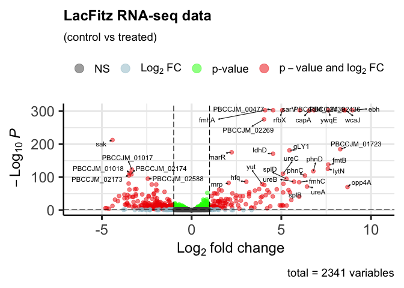<!-- -->

``` r
ggsave("figures/volcanoplot_rnaseq_LacFitz_pajd_value=0.002.pdf", width = 8, height = 8)
```

    ## Warning: ggrepel: 298 unlabeled data points (too many overlaps). Consider
    ## increasing max.overlaps

``` r
# Smaller p-value and selected genes only:
EnhancedVolcano(res,
                lab = str_replace(rownames(res),"\\(.*",""),
                selectLab = str_replace(genes_lf,"\\(.*",""),
                subtitle = "(control vs treated)",
                x = 'log2FoldChange',
                y = 'padj',
                col=c("grey30", "lightblue3", "green", "red2"),
                labSize = 3,
                pCutoff = 0.002,
                title = 'LacFitz RNA-seq data',
                drawConnectors = TRUE,
                widthConnectors = 0.40)
```

    ## Warning: One or more p-values is 0. Converting to 10^-1 * current lowest
    ## non-zero p-value...

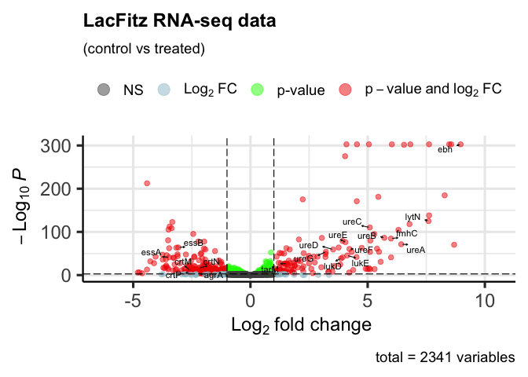<!-- -->

``` r
ggsave("figures/volcanoplot_rnaseq_LacFitz_pajd_value=0.002_selectLabelsOnly.pdf", width = 8, height = 8)
```

# Merging the two DEseq Tables:

(put your cursor here & click on Run All Chunks Below after changing
my_pvalueajd.

``` r
### CHANGE THIS!! ###
#my_pvalueajd=10e-32
my_pvalueajd=0.002
### CHANGE THIS!! ###

merge_significant_genes <- function(my_pvalueajd) {
  
  print(my_pvalueajd)
  # Read in the output tables from DESeq2, and only pick genes with pvalue < 10e-31 and those with <-2 or >2 log2FoldChange, as per the Volcano plots:

LF <- read.table("output/LacFitz_rnaseq.results.tsv", header=TRUE) %>% filter((pvalue < my_pvalueajd) & ((log2FoldChange > 2)|(log2FoldChange < -2))) %>% mutate(Regulation = ifelse(log2FoldChange > 2, "upregulated","downregulated")) %>% mutate(Sample = "LacFitz")

MW2 <- read.table("output/MW2_rnaseq.results.tsv", header=TRUE) %>% filter((pvalue < my_pvalueajd) & ((log2FoldChange > 2)|(log2FoldChange < -2))) %>% mutate(Regulation = ifelse(log2FoldChange > 2, "upregulated","downregulated")) %>% mutate(Sample = "MW2")

# Merge the two tables together:
LF_MW2_significant_genes <- rbind(LF, MW2)

# Pull the gene name only from the table:
LF_MW2_significant_genes$Gene = str_replace(LF_MW2_significant_genes$gene_start_end_direction," \\(.*","")

print(genes %in% LF_MW2_significant_genes$Gene)

# save table:
write.table(LF_MW2_significant_genes, paste0("output/LF_MW2_significant_genes_pvalue_",my_pvalueajd,".tsv"),
            sep="\t", 
            row.names = FALSE, 
            quote = FALSE, 
            col.names = TRUE)
  
}

merge_significant_genes(my_pvalueajd)
```

    ## [1] 0.002
    ##  [1] TRUE TRUE TRUE TRUE TRUE TRUE TRUE TRUE TRUE TRUE TRUE TRUE TRUE TRUE TRUE
    ## [16] TRUE TRUE TRUE TRUE TRUE

## Plotting a heatmap:

``` r
LF_MW2_significant_genes <- read.table(file = paste0("output/LF_MW2_significant_genes_pvalue_",my_pvalueajd,".tsv"),
                                       header=TRUE,
                                       sep="\t")


# Plotting a heatmap of upregulated vs downregulated genes, just by gene names:
LF_MW2_significant_genes %>% select(Regulation, Sample, Gene) %>% arrange(Gene) %>%
  ggplot(aes(x=Sample, y=Gene, fill=Regulation))+
  geom_tile(color="white")+
  theme_bw() +
  scale_fill_manual(values=c("#3674a3","#c93c67"))+
  scale_y_discrete(limits=rev)+
  theme(panel.grid = element_blank())
```

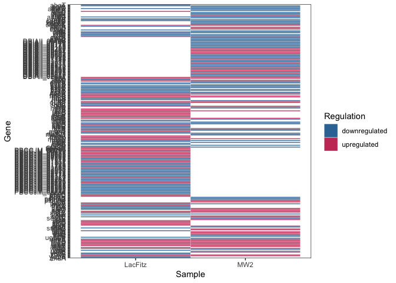<!-- -->

``` r
# there are some locus tag without any assigned names in both genomes. Since they are unknown genes, they might be actually representing the same genes, but with unknown function. For this reason, we filter them out from the heatmap, since they shouldn't be shown as separate rows. 
# Futher work is needed to compare those sequences.

LF_MW2_significant_genes %>% select(Regulation, Sample, Gene) %>% arrange(Gene) %>% filter(!grepl("PBCCJM",Gene)) %>%
  filter(!grepl("DBIAII",Gene)) %>%
  ggplot(aes(x=Sample, y=Gene, fill=Regulation))+
  geom_tile(color="white")+
  theme_bw() +
  scale_fill_manual(values=c("#3674a3","#c93c67"))+
  scale_y_discrete(limits=rev)+
  theme(panel.grid = element_blank())
```

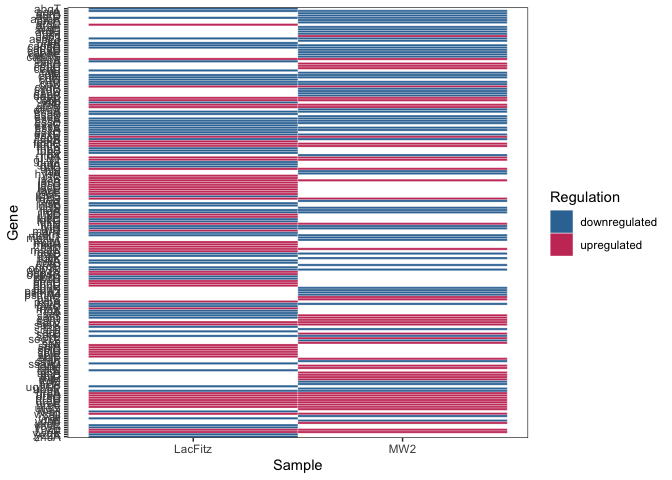<!-- -->

## Plotting a Venn diagram:

``` r
# List of genes in BOTH samples:
genes_in_both <- LF_MW2_significant_genes %>% group_by(Gene) %>% tally() %>% filter(n>1) %>% pull(Gene)

genes_in_both
```

    ##  [1] "agrA"  "amaP"  "asp23" "cap8B" "cap8C" "capA"  "crtM"  "crtN"  "crtP" 
    ## [10] "crtQ"  "cwrA"  "dprA"  "ebh"   "efeB"  "efeO"  "esaA"  "essA"  "essB" 
    ## [19] "essC"  "esxA"  "esxB"  "esxD"  "fTR1"  "feoA"  "fetB"  "fmhC"  "fmtB" 
    ## [28] "gLY1"  "hfq"   "lacA"  "ldhD"  "lrgA"  "lrgB"  "lytN"  "lytR"  "lytS" 
    ## [37] "metL1" "msaC"  "mtlD"  "opp3C" "pyrB"  "sarS"  "sarT"  "sarV"  "sasC" 
    ## [46] "sdrE"  "uraA"  "ureA"  "ureB"  "ureC"  "ureD"  "ureE"  "ureF"  "ureG" 
    ## [55] "wcaJ"  "yut"   "ywqE"

``` r
length(genes_in_both)
```

    ## [1] 57

``` r
## Venn diagram:
genes_in_LF_up <- LF_MW2_significant_genes %>% filter((Sample == "LacFitz") & (Regulation == "upregulated")) %>% pull(Gene)
genes_in_LF_down <- LF_MW2_significant_genes %>% filter((Sample == "LacFitz") & (Regulation == "downregulated")) %>% pull(Gene)
genes_in_MW2_up <- LF_MW2_significant_genes %>% filter((Sample == "MW2") & (Regulation == "upregulated")) %>% pull(Gene)
genes_in_MW2_down <- LF_MW2_significant_genes %>% filter((Sample == "MW2") & (Regulation == "downregulated")) %>% pull(Gene)

library(VennDiagram)
```

    ## Loading required package: grid

    ## Loading required package: futile.logger

``` r
library(RColorBrewer)
myCol <- brewer.pal(4, "Pastel2")

venn.diagram(
  x = list(genes_in_LF_up, genes_in_LF_down, genes_in_MW2_up, genes_in_MW2_down),
  category.names = c("LacFitz up","LacFitz down","MW2 up", "MW2 down"),
  filename = paste0("figures/LF_MW2_venn_diagram_pvalue",my_pvalueajd,".tiff"),
  imagetype = "tiff",
  output=TRUE,
  
          # Circles
        lwd = 1,
        #lty = 'blank',
        fill = myCol,
  col = c("black","black","black","black")
)
```

    ## Warning in tiff(filename = filename, height = height, width = width, units =
    ## units, : compression is not supported for type = "quartz"

    ## [1] 1

# Comparing the FAA identidies between the 2 strains:

In the previous table, we merged the genes based on names. In some case,
esp those without a gene name (e.g. those with an ID “PBCCJM”or
“DBIAII”), we want to know how distant or similar they are.

I used mmseqs2 to compare the proteins.

``` bash
mmseqs_avx2 createdb ref/LacFitz_annotation/LacFitz_assembly.faa LF_db
mmseqs_avx2 easy-search ref/MW2_annotation/MW2_assembly.faa LF_db results.m8 ./tmp
```

``` r
mmseq2 <- read.table("results.m8")
colnames(mmseq2) <- c("query_id", "target_id", "seq_identity", "alignment_length", "mismatches", 
              "gap_openings", "query_start", "query_end", "target_start", "target_end", 
              "e_value", "bit_score")

unknown_genes <- LF_MW2_significant_genes %>% select(Regulation, Sample, Gene) %>% arrange(Gene) %>% filter(grepl("PBCCJM",Gene) | grepl("DBIAII",Gene)) %>% pull(Gene)

mmseq2_subset <- mmseq2 %>% filter(query_id %in% unknown_genes | target_id %in% unknown_genes)

# A protein identity of 40% is pretty good:

# YOU CAN CHANGE THIS!
identity_percent = 0.8

good_matches <- mmseq2_subset %>% filter(seq_identity>identity_percent) %>% select(1:2)
good_matches$combined_Genename <- paste0(good_matches$query_id,"=",good_matches$target_id)

# Reorganize the table of significant genes such that if a gene is present in the perfect match table, give it a new name.

LF_MW2_significant_genes_good_matches <- LF_MW2_significant_genes %>% left_join(good_matches, by=c("Gene"="query_id"))
colnames(LF_MW2_significant_genes_good_matches)[12] <- "combined_Genename1"

LF_MW2_significant_genes_good_matches <- LF_MW2_significant_genes_good_matches %>% left_join(good_matches, by=c("Gene"="target_id"))

LF_MW2_significant_genes_good_matches <- LF_MW2_significant_genes_good_matches %>% arrange(combined_Genename1, combined_Genename)


LF_MW2_significant_genes_good_matches$GeneName_clean <- "" 


length(which(!is.na(LF_MW2_significant_genes_good_matches$combined_Genename1)))
```

    ## [1] 40

``` r
length(which(!is.na(LF_MW2_significant_genes_good_matches$combined_Genename)))
```

    ## [1] 46

``` r
LF_MW2_significant_genes_good_matches$GeneName_clean[1:length(which(!is.na(LF_MW2_significant_genes_good_matches$combined_Genename1)))] <- LF_MW2_significant_genes_good_matches$combined_Genename1[1:length(which(!is.na(LF_MW2_significant_genes_good_matches$combined_Genename1)))]

LF_MW2_significant_genes_good_matches$GeneName_clean[(length(which(!is.na(LF_MW2_significant_genes_good_matches$combined_Genename1)))+1):(length(which(!is.na(LF_MW2_significant_genes_good_matches$combined_Genename1)))+length(which(!is.na(LF_MW2_significant_genes_good_matches$combined_Genename))))] <-
LF_MW2_significant_genes_good_matches$combined_Genename[(length(which(!is.na(LF_MW2_significant_genes_good_matches$combined_Genename1)))+1):(length(which(!is.na(LF_MW2_significant_genes_good_matches$combined_Genename1)))+length(which(!is.na(LF_MW2_significant_genes_good_matches$combined_Genename))))]

LF_MW2_significant_genes_good_matches <- LF_MW2_significant_genes_good_matches %>% mutate(GeneName_clean = ifelse(test = GeneName_clean == "", yes = Gene,  no = GeneName_clean))

# clean up the table:
head(LF_MW2_significant_genes_good_matches)
```

    ##       gene_start_end_direction  baseMean log2FoldChange     lfcSE       stat
    ## 1 DBIAII_00174 (184300-185520) 3478.5426      -4.475272 0.8719578  -5.132441
    ## 2 DBIAII_00175 (185517-186005)  585.6676      -3.801917 0.8754118  -4.343004
    ## 3 DBIAII_00176 (186104-186793) 1625.6199      -5.230575 0.4858303 -10.766260
    ## 4 DBIAII_00177 (186920-187363)  106.4945      -5.382755 0.4520825 -11.906577
    ## 5 DBIAII_00178 (187430-187825) 5697.2287      -5.908127 0.8587557  -6.879870
    ## 6 DBIAII_00179 (187963-188262) 7897.0230      -6.246781 0.5267993 -11.857990
    ##         pvalue         padj    Regulation Sample         Gene    target_id
    ## 1 2.860088e-07 1.466695e-06 downregulated    MW2 DBIAII_00174 PBCCJM_00186
    ## 2 1.405477e-05 5.705931e-05 downregulated    MW2 DBIAII_00175 PBCCJM_00187
    ## 3 4.967729e-27 1.135988e-25 downregulated    MW2 DBIAII_00176 PBCCJM_00188
    ## 4 1.093764e-32 2.953163e-31 downregulated    MW2 DBIAII_00177 PBCCJM_00189
    ## 5 5.990740e-12 5.143773e-11 downregulated    MW2 DBIAII_00178 PBCCJM_00190
    ## 6 1.956148e-32 5.218724e-31 downregulated    MW2 DBIAII_00179 PBCCJM_00191
    ##          combined_Genename1 query_id combined_Genename
    ## 1 DBIAII_00174=PBCCJM_00186     <NA>              <NA>
    ## 2 DBIAII_00175=PBCCJM_00187     <NA>              <NA>
    ## 3 DBIAII_00176=PBCCJM_00188     <NA>              <NA>
    ## 4 DBIAII_00177=PBCCJM_00189     <NA>              <NA>
    ## 5 DBIAII_00178=PBCCJM_00190     <NA>              <NA>
    ## 6 DBIAII_00179=PBCCJM_00191     <NA>              <NA>
    ##              GeneName_clean
    ## 1 DBIAII_00174=PBCCJM_00186
    ## 2 DBIAII_00175=PBCCJM_00187
    ## 3 DBIAII_00176=PBCCJM_00188
    ## 4 DBIAII_00177=PBCCJM_00189
    ## 5 DBIAII_00178=PBCCJM_00190
    ## 6 DBIAII_00179=PBCCJM_00191

``` r
LF_MW2_significant_genes_good_matches <- LF_MW2_significant_genes_good_matches %>% select(-target_id, -combined_Genename1, -query_id, -combined_Genename)


write.table(LF_MW2_significant_genes_good_matches, "output/LF_MW2_significant_genes_clean.tsv",
            sep="\t", row.names = FALSE, quote = FALSE, col.names = TRUE)
```

# Replot heatmap with cleaned table:

``` r
heatmap_data <- LF_MW2_significant_genes_good_matches  %>% select(Regulation, Sample, GeneName_clean) %>% arrange(GeneName_clean) %>% distinct() %>% spread(Sample, Regulation)


LF_MW2_significant_genes_good_matches  %>% select(Regulation, Sample, GeneName_clean) %>% arrange(GeneName_clean) %>% distinct() %>%
  ggplot(aes(x=Sample, y=GeneName_clean, fill=Regulation))+
  geom_tile(color="white")+
  theme_bw() +
  scale_fill_manual(values=c("#3674a3","#c93c67"))+
  scale_y_discrete(limits=rev)+
  theme(panel.grid = element_blank(),
        text = element_text(size=6))+
  xlab("Genome")+
  ylab(paste0("Gene name (= means >",identity_percent," identical proteins in both genomes)\n PBCCJM = LacFitz, DBIAII = MW2"))
```

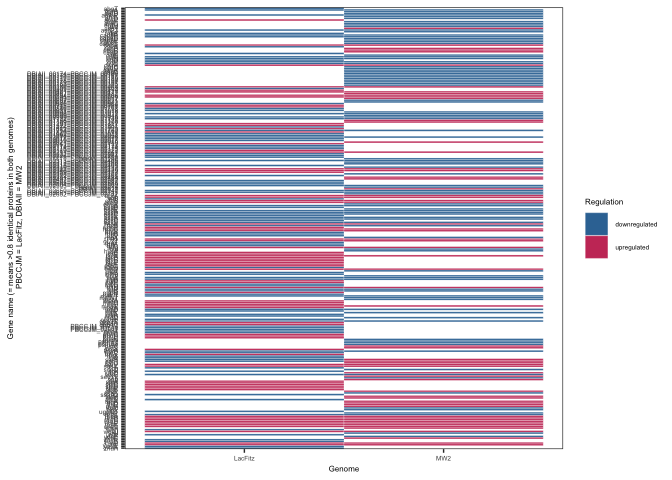<!-- -->

``` r
ggsave(paste0("figures/heatmap_gene_cleaned_padj_",my_pvalueajd,".pdf"), width = 4, height = 10)
```

# Remake the Venn Diagram now that the proteins are cleaned up:

``` r
## Venn diagram:
heatmap_data <- heatmap_data %>% gather(Sample, Regulation, 2:3) 

genes_in_LF_up <- heatmap_data %>% filter((Sample == "LacFitz") & (Regulation == "upregulated")) %>% pull(GeneName_clean)
genes_in_LF_down <- heatmap_data  %>% filter((Sample == "LacFitz") & (Regulation == "downregulated")) %>% pull(GeneName_clean)
genes_in_MW2_up <- heatmap_data  %>% filter((Sample == "MW2") & (Regulation == "upregulated")) %>% pull(GeneName_clean)
genes_in_MW2_down <- heatmap_data %>% filter((Sample == "MW2") & (Regulation == "downregulated")) %>% pull(GeneName_clean)

venn.diagram(
  x = list(genes_in_LF_up, genes_in_LF_down, genes_in_MW2_up, genes_in_MW2_down),
  category.names = c("LacFitz up","LacFitz down","MW2 up", "MW2 down"),
  filename = paste0("figures/LF_MW2_venn_diagram_clean_pvalue",my_pvalueajd,".tiff"),
  imagetype = "tiff",
  output=TRUE,
  
          # Circles
        lwd = 1,
        #lty = 'blank',
        fill = myCol,
  col = c("black","black","black","black")
)
```

    ## Warning in tiff(filename = filename, height = height, width = width, units =
    ## units, : compression is not supported for type = "quartz"

    ## [1] 1
